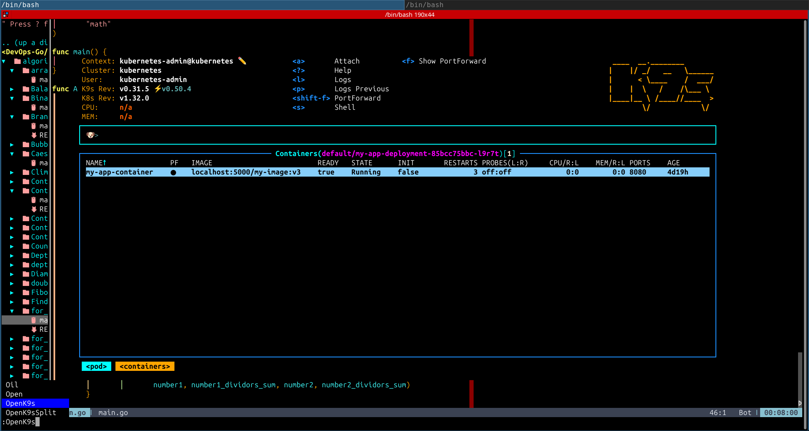

# nvim_GolangIDE


This Neovim configuration is specifically crafted for efficient development in Golang, with a focus on utilizing the latest plugins and modern tooling.

The setup includes:

Code autocompletion, syntax highlighting, integrated snippets, and testing frameworks.

Intelligent hints and automation for Golang programming, along with full support for Golang templates.

Integration of Neovim extensions and Visual Studio Code enhancements for an improved development experience.

Built-in support for interaction with Kubernetes and Helm, enabling seamless infrastructure and DevOps workflows.

Custom configurations tailored for editing various DevOps-related files, such as Jenkinsfiles, GitLab CI/CD pipelines, and Ansible playbooks and roles.

Key features:

Seamless integration with Codewars, HackerRank, and LeetCode for deepening knowledge in algorithms and data structures.

Optimized for use with the i3 Tiling Window Manager to maximize productivity and streamline the development environment.

The idea of ​​creating it emerged based on making your own custom version that would be extremely easy, adaptable to changes at will regarding situations and technologies, and provide something new in open source.

# -----


Ця версія конфігурації Neovim спеціально створена для ефективної роботи з мовою Golang, з акцентом на використання найновіших плагінів та сучасних інструментів.

Конфігурація включає:

Автодоповнення коду, підсвічування синтаксису, інтеграцію сніпетів та системи тестування.

Підказки та автоматизацію для програмування на Golang, а також роботу з Golang templates.

Інтеграцію доповнень Neovim і розширень із Visual Studio Code для ще кращого середовища розробки.

Підтримку взаємодії з Kubernetes та Helm, що дозволяє ефективно працювати з інфраструктурними проєктами.

Спеціальні налаштування для роботи з файлами DevOps-спрямування, такими як Jenkinsfiles,  GitLab CI/CD, а також плейбуки та ролі Ansible.

Особливості:

Підготовлено інтеграцію з платформами Codewars, HackerRank та LeetCode — для поглибленого вивчення алгоритмів і структур даних.

Конфігурація оптимізована для роботи в середовищі з використанням i3 Tiling Window Manager для максимальної продуктивності та зручності.

ідея створення   появилася на основі  зробити свій кастомний варіант який був би надзвичайно легким , піддавався змінам по бажанню відносно ситуацій та технологій , та надати щось нове в опенсорс. 

# ---


plugins.vim is main file for provision neovim components

```
~/.config/nvim
 $ ls
autoload  coc-settings.json  init.vim  lua  plugin_config  snippets  vim-plug

~/.config/nvim/snippets)
 └> $ tree
.
├── go.json
├── golang2_snippets
│   ├── go.lua
│   └── init.lua
└── golang_snippets
    ├── go.lua
    └── init.lua

```


Here’s what each folder or file is for:

| Name                  | Description |
|-----------------------|-------------|
| `autoload/`           | Traditional Vim folder for autoload functions or plugins (used by some plugin managers like vim-plug). |
| `coc-settings.json`   | Settings for the `coc.nvim` plugin — a VSCode-style language server/client for Neovim. |
| `init.vim`            | Your main Neovim config file (written in VimScript). |
| `lua/`                | Where you can store Lua modules or configuration if you use Lua-based plugins or config. |
| `plugin_config/`      | Often used to keep plugin configurations separated by file — e.g., one file per plugin. |
| `snippets/`           | Folder for code snippets, used by plugins like `UltiSnips`, `LuaSnip`, `coc-snippets`, etc. |
| `vim-plug/`           | Likely contains `plugins.vim`, where your `Plug` declarations live (plugin manager config). |

---

## 🔧 Example of how it all connects

If you're using a hybrid config (VimScript + Lua), you might have something like this:

### `init.vim`:
```vim
source $HOME/.config/nvim/vim-plug/plugins.vim
lua require('myconfig')  " loads lua/myconfig.lua
```

### `lua/myconfig.lua`:
```lua
require("plugin_config.gitsigns")
require("plugin_config.gh")
```

---





